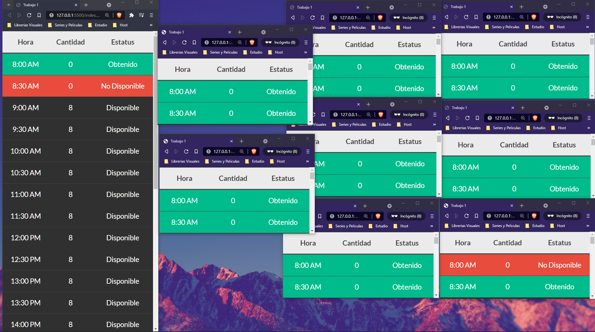

<!-- Please update value in the {}  -->

<h1 align="center">App Motorcyclists</h1>

   Solution for a challenge.

  <h3>
    <a href="https://motorcyclists.netlify.app/">
      Demo
    </a>
     | 
    <a href="https://github.com/sedian27/App-Motorcyclists">
      Solution
    </a>
  </h3>

<!-- TABLE OF CONTENTS -->

## Table of Contents

- [Table of Contents](#table-of-contents)
- [Overview](#overview)
  - [Built With](#built-with)
- [Features](#features)
- [Contact](#contact)

<!-- OVERVIEW -->

## Overview

### Built With

<!-- This section should list any major frameworks that you built your project using. Here are a few examples.-->

- HTML5
- Bootstrap
- JavaScript
- Firebase

## Features

<!-- List the features of your application or follow the template. Don't share the figma file here :) -->
Mi primera aplicacion con firebase, esta aplicación cumple con los casos de uso y requisitos pedidos.

Requisitos
- Lista que contenga tramos horarios en intervalos de 30 minutos
- Que inicie a las 8 am y termine a las 8 pm.
- La empresa tiene una disponibilidad de 8 motociclistas cada 30 minutos.
- Si otros usuarios han tomado todos los recursos la fila debe ser de color rojo.

Casos de Uso
- El usuario proda adquirir un recurso si este se encuentra disponible.
- El usuario solo podrá agarrar 1 recursos de cada horario.
- El usuario podrá liberar el recurso.

## Contact

- GitHub [@sedian27](https://github.com/sedian27)
- Web [sergiodiestra.com](https://sergiodiestra.com)
- LinkedIn [Sergio Diestra](https://www.linkedin.com/in/segio-diestra-andrade-596276174/)
